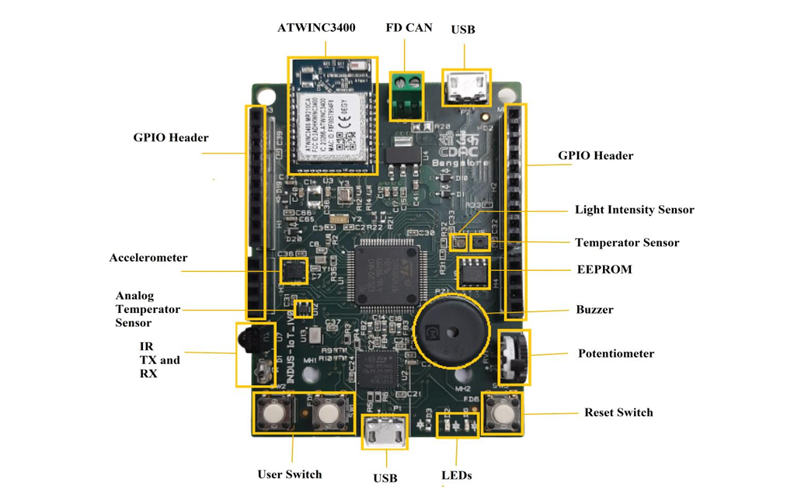

# INDUS IoT Development Board

The **INDUS IoT Development Kit** is an advanced embedded development platform designed by the Centre for Development of Advanced Computing (C-DAC), Bangalore.  

It is targeted for IoT experimentation, embedded firmware development, and rapid prototyping.

---

## 🧠 Core Specifications

- ARM Cortex-M4 Microcontroller (Up to 170 MHz)
- Floating Point Unit (FPU)
- DSP Instruction Support
- 128 KB Flash Memory
- 32 KB SRAM
- 32 Kbit External EEPROM (SPI)

---

## 🔌 Communication Interfaces

- USB (Device)
- SPI
- UART / USART
- I2C
- FDCAN
- Wi-Fi (WLAN)
- Bluetooth / BLE

---

## 📡 Analog & Signal Features

- ADCs and DACs
- Rail-to-rail Comparators
- Programmable Gain Op-Amps
- Hardware Accelerators for Mathematical Functions
- DSP Support

---

## 🧩 On-board Sensors & Actuators

- 3-Axis Digital Accelerometer
- Digital Temperature Sensor
- Digital Humidity Sensor
- Digital Light Sensor
- MEMS Microphone (PDM)
- Analog Temperature Sensor
- Potentiometer (ADC Input)
- Piezoelectric Buzzer
- User LEDs
- Push Buttons

---

## 🛠 Debug & Development Support

- On-board USB-SWD Debugger
- Compatible with STM32CubeIDE
- Suitable for HAL and Register-Level Programming

---

## 🚀 Advantages of INDUS Board

- All-in-one IoT prototyping platform
- Integrated wireless connectivity
- Rich sensor ecosystem for experimentation
- Built-in debugging support
- Ideal for embedded systems learning and firmware development
- Supports real-time DSP-based applications

---

## 📷 INDUS IoT Board

